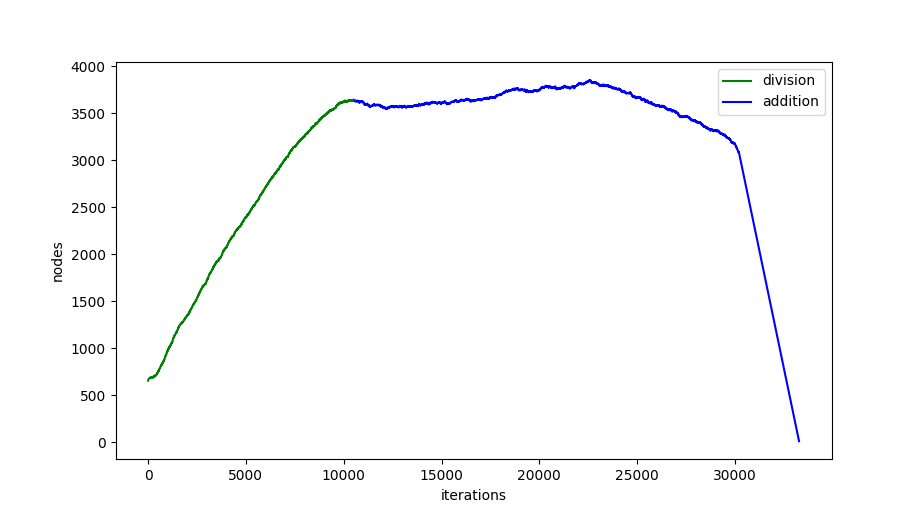
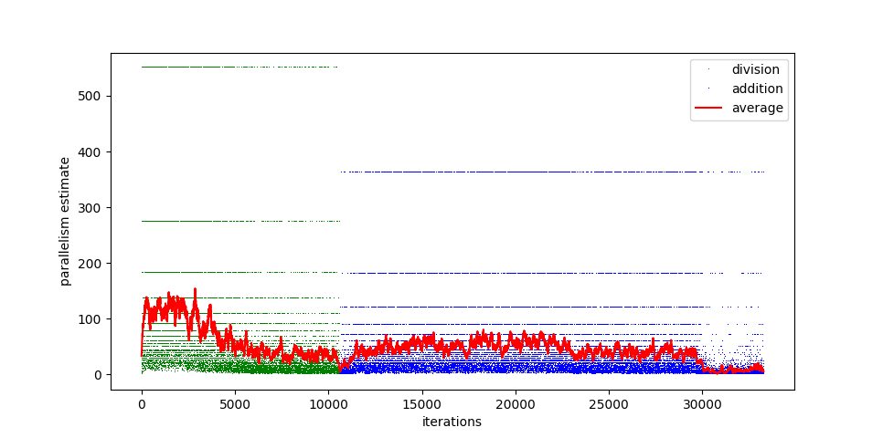

# Day 1

Division and addition are performed using the native base-10 format in which the
input data is provided. The bulk of the mathematical rules are created by
build-adder.py and build-divider.py.

Division can proceed in parallel on different entries. Similarly, multiple additions
can be performed in parallel. This parallelism might make it more likely to find a
working production, earlier in the shuffled list, although I don't have the statistics
to back that theory up.

## Part 1

Using part1.json and input.txt, result for part 1:

```
--------------------------------------------------------------------------------
    Grammar              Steps  Time  
  1 divide_numbers.json     650  201.6s
  2 subtract_two.json       124    5.4s
  3 add_numbers.json       3247 1188.1s
--------------------------------------------------------------------------------
3323874
```

## Part 2

Unfortunately, for this portion division and subtraction had to be
carried out in the same rule set rather than sequentially.  (I considered
adding a loop to the job engine instead.)  I also had to implement a
new set of rules to copy a value. But, the addition grammar could be
re-used with only a minor change.

A full 25 hours of execution for part2.json and input.txt:

```
--------------------------------------------------------------------------------
    Grammar              Steps  Time  
  1 recursive_fuel.json   10585 21579.2s
  2 add_numbers.json      22691 67062.3s
--------------------------------------------------------------------------------
4982961
```

## Example run

Number of nodes running part 2:



Estimated parallelism (number of production rules that could be applied):



Here's the graph after step 1 of part 2:


