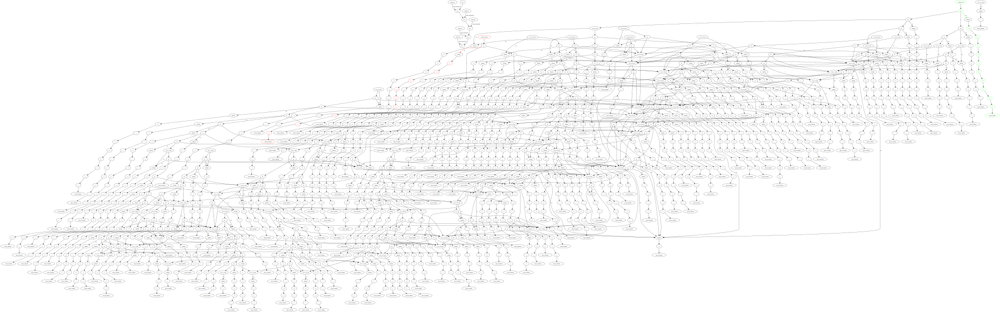

## Design Notes

Idea: implement a 3-D dynamic programming solution

```
N( digit, num remaining digits, need_double )
```

Base cases:

```
N( digit, 1, true ) = 1
N( digit, 1, false ) = 10 - digit    (digit, digit+1, digit+2, ... 9)
```

Recurrence:
```
N( digit, num remaining digits, true ) =o
  N( digit, num_remaining_digits - 1, false ) +
  N( digit + 1, num_remaining_digits - 1, true ) +
  N( digit + 2, num_remaining_digits - 1, true ) +
  ...
  N( 9, num_remaining_digits - 1, true )`

N( digit, num remaining digits, false ) =
  N( digit, num_remaining_digits - 1, false ) +
  N( digit + 1, num_remaining_digits - 1, false ) +
  N( digit + 2, num_remaining_digits - 1, false ) +
  ...
  N( 9, num_remaining_digits - 1, false )
```

For the input bounds

```
367479-893698
```

We can add up N( 3, 5, true ) through N( 8, 5, true ) 
and then subtract 33xxxx, 34xxxx, 35xxxx, 366xxx and 89xxxx.
i.e., N( 3, 4, false ), N( 4, 4, true), N( 5,4,true), N( 6, 3, false ), N(9, 4, true ).


We can represent each position in the DP via a node:

```
N->X [digit]; N->Y [remaining]; N->Z [need_double];
```

With an extra edge `N->V [value]` for evaluation.

If we try to construct these bottom-up, we need a mechanism to create each intermediate state just once. That's
the approach I took, with a construction rule built first specifying what DP nodes to create.

If we construct them top-down, we need to merge duplicates, but the number of nodes created before merging
could be very large.

Indented version of output computation tree:

```
OUTPUT[output_plus]; 
OUTPUT->S2[=]; 
    S2[dp]; 
    S2->S4[+]; 
        S4[dp]; 
        S4->S5[+]; 
            S5[N(3,5,true)]; 
        S4->S6[+]; 
            S6[dp]; 
            S6->S7[+]; 
                S7[N(4,5,true)]; 
            S6->S8[+]; 
                S8[N(5,5,true)]; 
    S2->S9[+]; 
        S9[dp]; 
        S9->S10[+]; 
            S10[N(6,5,true)]; 
        S9->S11[+]; 
            S11[dp]; 
            S11->S12[+]; 
                 S12[N(7,5,true)]; 
            S11->S13[+]; 
                 S13[N(8,5,true)]; 
OUTPUT[output_minus]; 
OUTPUT->S3[=]; 
S3[dp]; 
S3->S14[+]; 
    S14[dp]; 
    S14->S15[+]; 
         S15[N(3,4,false)]; 
    S14->S16[+]; 
         S16[N(4,4,true)]; 
S3->S17[+]; 
    S17[dp]; 
    S17->S18[+]; 
         S18[dp];
         S18->S19[+];
              S19[N(5,4,true)]; 
         S18->S20[+];
              S20[N(6,3,false)]; 
    S17->S21[+]; 
         S21[N(9,4,true)];
```

## Part 1

I implemented a rule set that prettifies the output by putting labels on nodes
instead of leaving them in "raw" form; this helps readability a bit, but the
layout engine doesn't really know how to find the underlying grid.

I didn't end up doing the last subtraction in Soffit.

```
--------------------------------------------------------------------------------
    Grammar              Steps  Time  
  1 construct_dp.json       322   30.2s
  2 compute_sums.json      1777 1042.7s
  3 prettify.json           448  587.6s
```

reversed plus:  0010100111 = 916 decimal

reversed minus: 101001011 = 421 decimal

answer = 495


