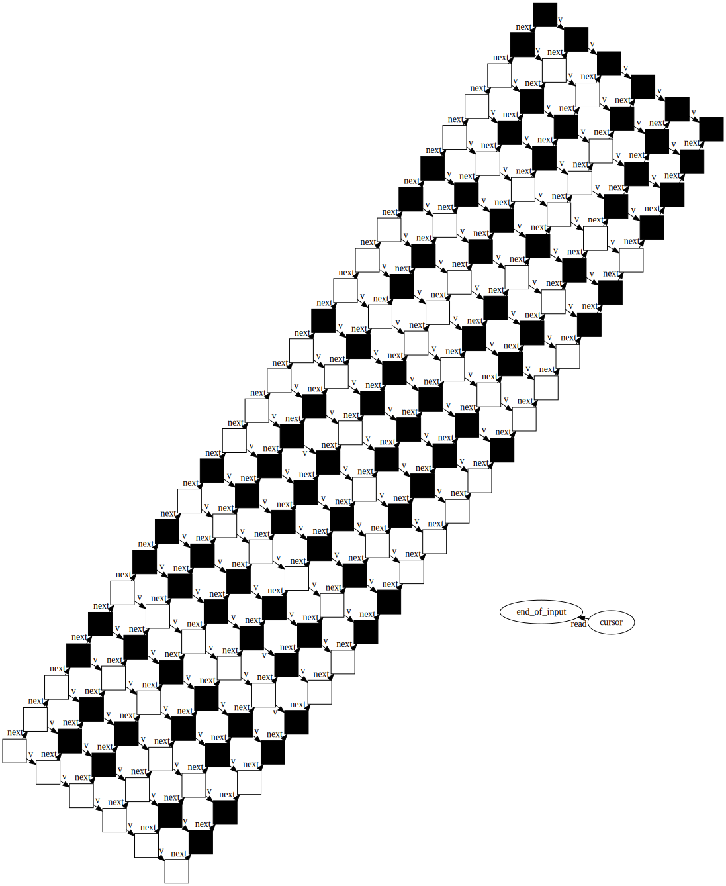

## Design notes

It's possible but tedious to construct a fixed-sized grid node by node,
so I took a shortcut and created a single production that makes the
25x6 grid for this problem.

I needed to substantially improve the performance of Soffit to handle
graphs of this size.  The eventual run time for part 1 was:

```
--------------------------------------------------------------------------------
    Grammar              Steps  Time  
  1 read_layers.json      15102 22961.7s
  2 count_per_layer.json  16467 98574.1s
  3 reverse_tokens.json    5414 4828.4s
--------------------------------------------------------------------------------
    Grammar              Steps  Time  
  1 compare_0.json          422  424.0s
  2 prettify.json           700  830.4s
```

I ended up doing this in two parts because my comparison grammar had a bug,
so I restarted using the saved Dot file.


Possibly this would have gone faster if I had counted each layer and then discarded it?
We don't actually need to put things in grids for part 1.

## Part 2

This rule turned out to be more complicated too; I couldn't find a good way
to separate overlay and interaction, so the rules covered a lot of possibilities.

```
--------------------------------------------------------------------------------
    Grammar              Steps  Time  
  1 paint_layers.json     15001 42342.9s
  2 cut-rows.json             7    0.0s
  3 style.json              150    0.5s
```

Because the letters were white-on-black (rather than black-on-white) the resulting
graph is hard to read.  I had to fill in all the background space in order to read it.




Of course, the latter didn't come out with the right orientation...
